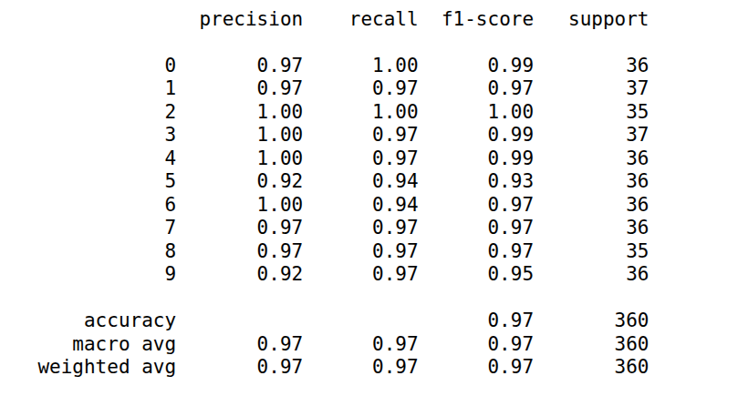
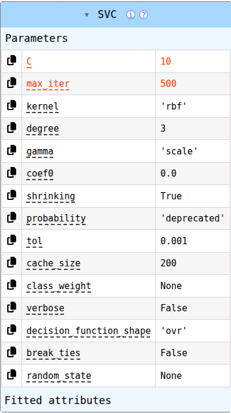

# 🔢 Handwritten Digit Recognition — MLOps Project


## 📌 Project Overview

This project is a **Handwritten Digit Recognition System** built using Machine Learning and deployed as an interactive **Streamlit web application**.

The model is trained using the **Scikit-learn Digits Dataset** and uses a **Support Vector Classifier (SVC)** to classify handwritten digits from `0` to `9`.

The project also demonstrates fundamental **MLOps practices**, including:

* Machine Learning model training
* Image preprocessing
* Model serialization
* Streamlit application
* Logging
* Docker containerization
* Git/GitHub version control
* Model evaluation
* Hyperparameter configuration

---

## 🚀 Features

* ✍️ Upload a handwritten digit image
* 🖼️ Image preprocessing and normalization
* 🔢 Predict digits from `0` to `9`
* 🤖 SVC-based classification
* 📊 Classification report
* ⚙️ Hyperparameter configuration
* 📝 Application logging
* 🐳 Dockerized application
* 🌐 Interactive Streamlit UI
* 📦 Saved trained model using Pickle

---

## 🧠 Machine Learning Model

### Algorithm

**Support Vector Classifier (SVC)**

SVC is a supervised machine learning algorithm that finds an optimal decision boundary between different classes.

For this project, the classifier is trained to recognize:

```text
0  1  2  3  4  5  6  7  8  9
```

### Dataset

The project uses the built-in:

**Scikit-learn Digits Dataset**

Dataset characteristics:

* Number of classes: `10`
* Image size: `8 × 8`
* Total features: `64`
* Pixel values: approximately `0–16`
* Classes: digits `0–9`

---

## 🔄 Machine Learning Pipeline

```text
              Digits Dataset
                    │
                    ▼
             Data Preparation
                    │
                    ▼
             Train / Test Split
                    │
                    ▼
             Feature Processing
                    │
                    ▼
             SVC Model Training
                    │
                    ▼
            Hyperparameter Tuning
                    │
                    ▼
              Model Evaluation
                    │
                    ▼
               model.pkl
                    │
                    ▼
             Streamlit Application
                    │
                    ▼
             Docker Container
```

---

## 🖼️ Image Preprocessing

For uploaded real-world digit images, the application performs preprocessing before sending the image to the model.

The preprocessing pipeline includes:

```text
Input Image
    ↓
Grayscale Conversion
    ↓
Image Inversion
    ↓
Resize to 8 × 8
    ↓
Pixel Normalization
    ↓
Scale to 0–16
    ↓
Flatten to 64 Features
    ↓
SVC Prediction
```

This preprocessing is important because the original Scikit-learn Digits Dataset contains small `8 × 8` images with pixel values in a similar range.

---

## 📊 Model Evaluation

The trained SVC model is evaluated using classification metrics such as:

* Accuracy
* Precision
* Recall
* F1-score
* Support

### Classification Report

The generated classification report is available in the `public` directory.



---

## ⚙️ Hyperparameters

The SVC model was trained and evaluated using selected hyperparameters.

The hyperparameter results/configuration are available below:



> The hyperparameters can be modified and evaluated to find a better-performing model.

---

## 🛠️ Tech Stack

| Technology   | Purpose                  |
| ------------ | ------------------------ |
| Python       | Programming language     |
| NumPy        | Numerical operations     |
| Pandas       | Data manipulation        |
| Scikit-learn | Machine Learning         |
| SVC          | Classification algorithm |
| Pillow       | Image processing         |
| Matplotlib   | Visualization            |
| Streamlit    | Web application          |
| Pickle       | Model serialization      |
| Docker       | Containerization         |
| Git          | Version control          |
| GitHub       | Source code management   |

---

## 📁 Project Structure

```text
Digits/
│
├── .dockerignore
├── .gitignore
├── Dockerfile
├── README.md
├── requirements.txt
│
├── main.py
├── config.py
├── model.pkl
│
├── core/
│   ├── __init__.py
│   ├── digits.py
│   └── logger.py
│
├── public/
│   ├── classification_report.png
│   └── hyperparameters.png
│
└── logs/
    └── app.log
```

---

# 💻 Local Installation

## 1. Clone the Repository

```bash
git clone <YOUR_GITHUB_REPOSITORY_URL>
```

Move into the project directory:

```bash
cd Digits
```

---

## 2. Create Virtual Environment

```bash
python3 -m venv venv
```

Activate the environment on Linux/macOS:

```bash
source venv/bin/activate
```

For Windows:

```bash
venv\Scripts\activate
```

---

## 3. Install Dependencies

```bash
pip install -r requirements.txt
```

---

## 4. Run the Streamlit Application

```bash
streamlit run main.py
```

The application will be available at:

```text
http://localhost:8501
```

---

# 🐳 Run with Docker

This project is containerized using Docker.

## Build Docker Image

```bash
docker build -t digits-app .
```

## Run Docker Container

```bash
docker run -p 8501:8501 digits-app
```

Then open:

```text
http://localhost:8501
```

### Docker Architecture

```text
Dockerfile
     │
     ▼
Docker Image
     │
     ▼
Docker Container
     │
     ▼
Streamlit Application
     │
     ▼
Port 8501
```

---

# 📝 Logging

The application includes logging functionality for tracking application events.

Logs can contain information such as:

* Model loading
* Image preprocessing
* Prediction status
* Prediction result
* Errors and exceptions

Example:

```text
2026-09-15 16:00:00 - INFO - Digits model loaded
2026-09-15 16:00:05 - INFO - Starting image preprocessing
2026-09-15 16:00:05 - INFO - Image preprocessing completed
2026-09-15 16:00:06 - INFO - Prediction result: 7
```

Application logs are stored in:

```text
logs/app.log
```

---

# 🔮 Future MLOps Improvements

The project can be extended into a complete production-oriented MLOps pipeline.

Planned improvements include:

* [ ] GitHub Actions CI/CD
* [ ] Automated unit testing
* [ ] MLflow experiment tracking
* [ ] DVC for dataset/model versioning
* [ ] Model Registry
* [ ] Automated Docker image publishing
* [ ] Cloud deployment
* [ ] Model monitoring
* [ ] Data drift detection
* [ ] Model performance monitoring
* [ ] Automated model retraining

---

# 📈 MLOps Roadmap

```text
Machine Learning
       │
       ▼
Model Serialization
       │
       ▼
Streamlit Application
       │
       ▼
Logging
       │
       ▼
Docker
       │
       ▼
Git / GitHub
       │
       ▼
CI/CD ────────────────┐
       │              │
       ▼              ▼
   MLflow             DVC
       │              │
       └──────┬───────┘
              ▼
        Model Registry
              │
              ▼
          Deployment
              │
              ▼
         Monitoring
              │
              ▼
         Retraining
```

---

# 👨‍💻 Author

## Muhammad Haseeb Raza

**Machine Learning Engineer**

📧 Email: **[hasiraza511@gmail.com](mailto:hasiraza511@gmail.com)**

### Areas of Interest

* Machine Learning
* Deep Learning
* Computer Vision
* MLOps
* Model Deployment
* Python
* Data Science

---

# ⭐ Project

If you find this project useful, feel free to ⭐ **star the repository** and explore the code.

---

## 📄 License

This project is created for educational and portfolio purposes.
